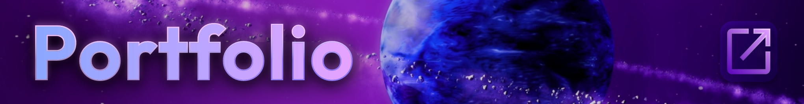

# Nicolas Reinhard
### *Developer, Technical Artist, Shaders, VFX, and Others.*

 
 

## Tech Stack

    
    
    
    
    
    
    
    

 

## Notable Works

## 🌱 Currently working on
- <a href="https://github.com/LTMX/Unity.mathx"><a> An extension library for Unity.Mathematics  

- <a href="https://github.com/LTMX/Unity.QOI"><a> An Importer and Exporter for the "Quite Ok" Image Format  
-  A Cinematic Tonemapper to fix ACES issues

- <a href ="https://github.com/ltmx/Unity.UIToolkit.Extensions">**`Unity UIToolkit Extensions`**</a> A framework to make ui coding simpler using UIElements
- <a href ="https://github.com/ltmx/Unity.PackageManagerTools">**`Unity Package Manager Tools`**</a> Enhanced Unity's Package Manager
- <a href ="https://github.com/ltmx/Unity.CSharp.Extensions">**`Unity Csharp Extensions`**</a> A collection of extension methods for Unity
- `ShaderGraph-Extensions` a vast node library for Unity's Shader Graph Tool `Puplic Release WIP`
 

  
  

### 📫 Contact

